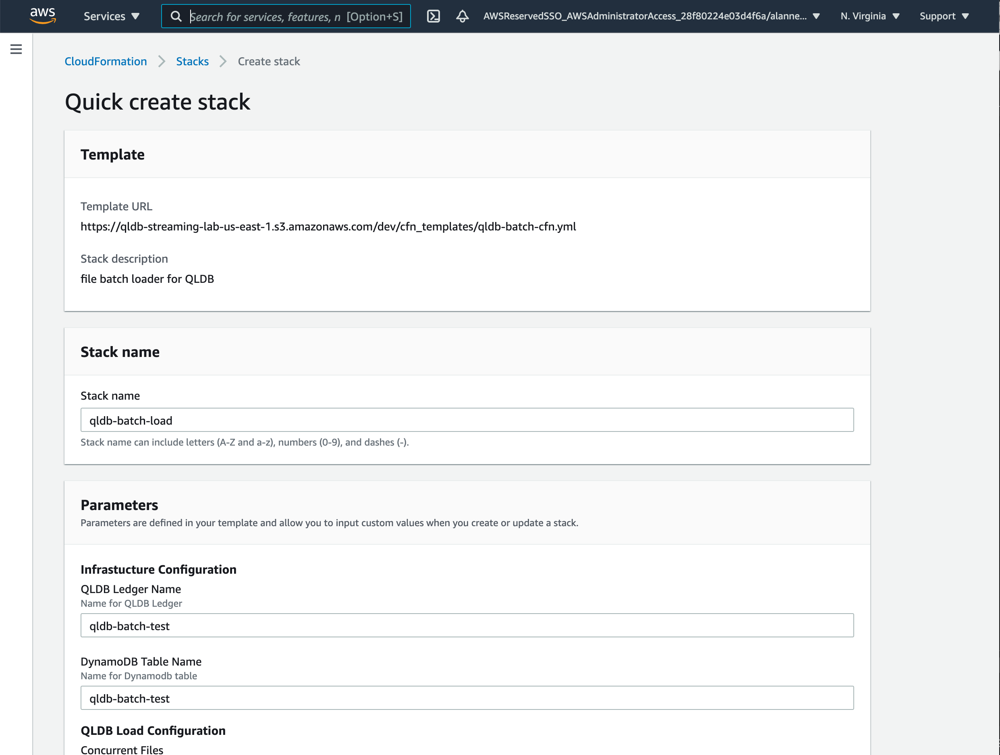
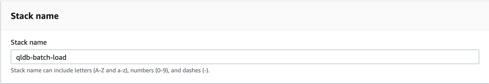
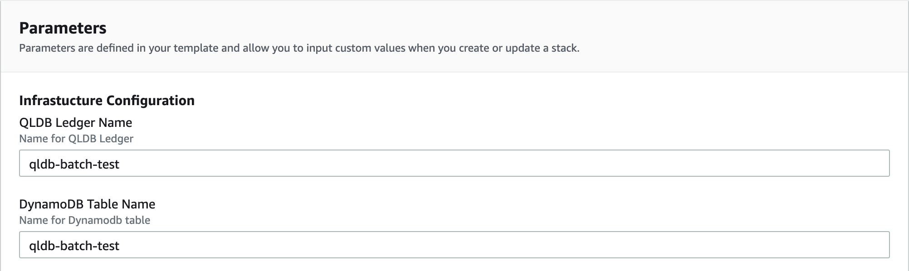
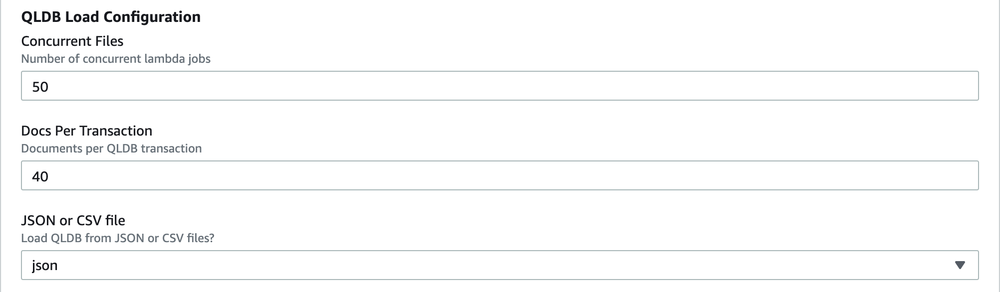
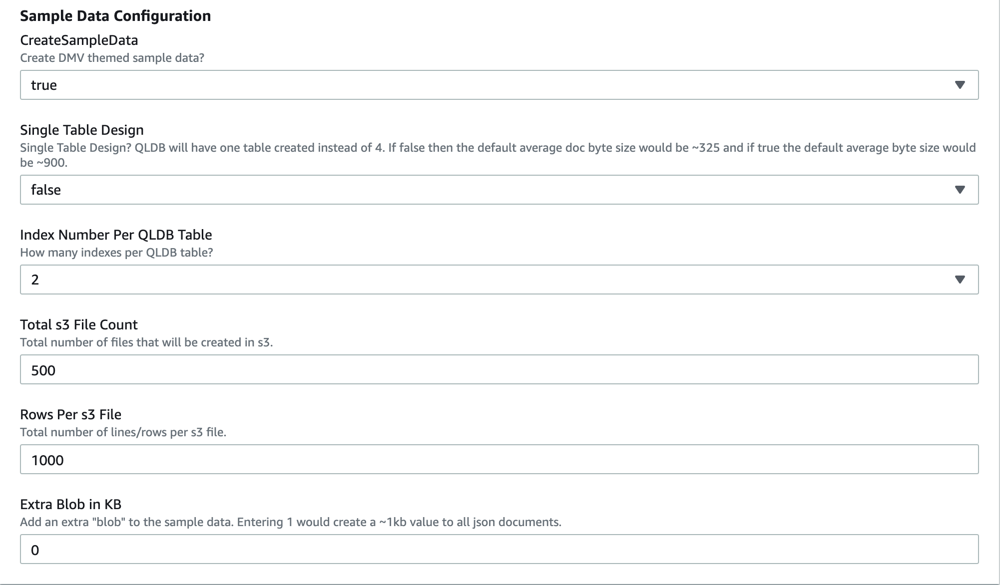
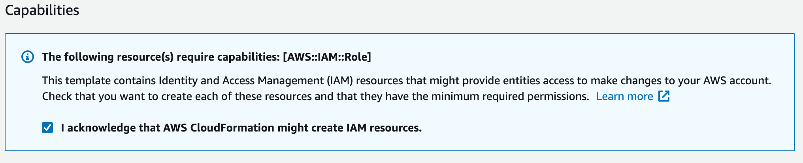

# qldb-s3-batch-load

# Amazon QLDB Data Simulation Tool

**WARNING**: This guide is for demonstration purposes only and should only be used in a development or test AWS environment. Elevated IAM privileges are used.

### Region Selection

This workshop can be deployed in any AWS region that supports the following services:

- Amazon QLDB
- Amazon DynamoDB
- AWS Lambda
- AWS Step Functions
- AWS CloudFormation

You can refer to the [region table](https://aws.amazon.com/about-aws/global-infrastructure/regional-product-services/) in the AWS documentation to see which regions have the supported services.

## Implementation Instructions

Each of the following sections provides an implementation overview and detailed, step-by-step instructions.

### 1. Launch CloudFormation template.

Launch one of these AWS CloudFormation templates in the Region of your choice.

Region| Launch
------|-----
US East (N. Virginia) | [](https://console.aws.amazon.com/cloudformation/home?region=us-east-1#/stacks/quickcreate?templateUrl=https%3A%2F%2Fqldb-streaming-lab-us-east-1.s3.amazonaws.com%2Fdev%2Fcfn_templates%2Fqldb-batch-cfn.yml&stackName=qldb-batch-load&param_BlobKB=0&param_ConcurrentFiles=50&param_CreateSampleData=true&param_DocPerTxn=40&param_DynamoName=qldb-batch-test&param_IndexNumPerTable=2&param_JSONorCSV=json&param_QLDBLedgerName=qldb-batch-test&param_RowsPers3File=1000&param_SingleTableDesign=false&param_Totals3FileCount=500)
US East (Ohio) | [](https://console.aws.amazon.com/cloudformation/home?region=us-east-2#/stacks/quickcreate?templateUrl=https%3A%2F%2Fqldb-streaming-lab-us-east-2.s3.amazonaws.com%2Fdev%2Fcfn_templates%2Fqldb-batch-cfn.yml&stackName=qldb-batch-load&param_BlobKB=0&param_ConcurrentFiles=50&param_CreateSampleData=true&param_DocPerTxn=40&param_DynamoName=qldb-batch-test&param_IndexNumPerTable=2&param_JSONorCSV=json&param_QLDBLedgerName=qldb-batch-test&param_RowsPers3File=1000&param_SingleTableDesign=false&param_Totals3FileCount=500)
US West (Oregon) | [](https://console.aws.amazon.com/cloudformation/home?region=us-west-2#/stacks/quickcreate?templateUrl=https%3A%2F%2Fqldb-streaming-lab-us-west-2.s3.amazonaws.com%2Fdev%2Fcfn_templates%2Fqldb-batch-cfn.yml&stackName=qldb-batch-load&param_BlobKB=0&param_ConcurrentFiles=50&param_CreateSampleData=true&param_DocPerTxn=40&param_DynamoName=qldb-batch-test&param_IndexNumPerTable=2&param_JSONorCSV=json&param_QLDBLedgerName=qldb-batch-test&param_RowsPers3File=1000&param_SingleTableDesign=false&param_Totals3FileCount=500)

### 2. Fill out the CloudFormation parameters.

A **Quick create stack** page will be opened that comes pre-populated with all required inputs.

In the **Stack name** block. Leave as default or change to a unique name. 

#### In the Parameters section, notice that there are three parameter groups. 
- Infrastructure Configuration
- QLDB Load Configuration
- Sample Data Configuration
    
In the **Infrastructure Configuration** section:

Set **QLDB Ledger Name** and **DynamoDB Table Name** to an account and region unique name.

In the **SQLDB Load Configuration** section, the parameters will determine how transactions load into QLDB.  

**Concurrent Files** will determine how many concurrent lambda functions execute QLDB transactions. For example, **100** will process 100 files from s3 in parallel and one file per lambda function.   

**Docs Per Transaction** will set how many documents to load per transaction.

**JSON or CSV file** will configure the loader to expect json or csv files from s3.

In the **Sample Data Configuration** section, use good judgement here and don't create data that can not be processed.  For example, a 1,000 row file will be processed, a 10,000 row file might get processed, a 100,000 will not get processed. QLDB has limits like all other AWS services.

The theme for the sample data is based on DMV data.

**Create Sample Data**, set to true or false.  If false, leave all other parameters as default.

**Single Table Design**, set to true if the DMV sample data is combined and loaded to a single QLDB table.  Setting false, will create four tables similar to the QLDB documentation examples. A one table design will create documents that average 950 bytes, a four table design will create documents that average 350 bytes.

**Total s3 File Count**, will create n number of sample data files in s3. 

**Rows Per s3 File** sets the number of rows to create per s3 file.  Each row will be a document in QLDB.

**Extra Blob in KB** will set an extra BLOB of KB size x for each QLDB document. 

#### Capabilities section

In the **Capabilities section**, check "I acknowledge that AWS CloudFormation might create IAM resources."

#### Create Stack

Now click on "Create stack".

Ensure that the CloudFormation stack creates with no issues.  The larger the sample data size, the longer the cloudformation stack will take to create. 

License
----

MIT
