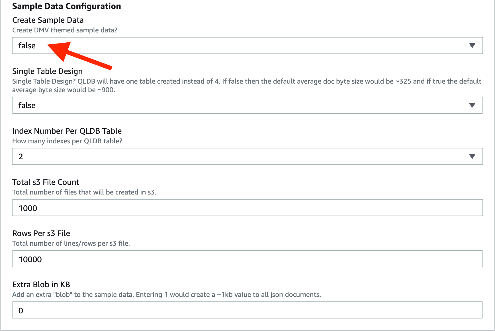

# qldb-s3-batch-load

# Amazon QLDB Data Simulation Tool


**WARNING**: This guide is for demonstration purposes only and should only be used in a development or test AWS environment. Elevated IAM privileges are used.

### Region Selection

This workshop can be deployed in any AWS region that supports the following services:

- Amazon QLDB
- Amazon DynamoDB
- AWS Lambda
- AWS Step Functions
- AWS CloudFormation

You can refer to the [region table](https://aws.amazon.com/about-aws/global-infrastructure/regional-product-services/) in the AWS documentation to see which regions have the supported services.


## Implementation Instructions

Each of the following sections provides an implementation overview and detailed, step-by-step instructions.

### 1. Launch CloudFormation template.

Launch one of these AWS CloudFormation templates in the Region of your choice.

Region| Launch
------|-----
US East (N. Virginia) | [](https://console.aws.amazon.com/cloudformation/home?region=us-east-1#/stacks/quickcreate?templateUrl=https%3A%2F%2Fqldb-streaming-lab-us-east-1.s3.amazonaws.com%2Fdev%2Fcfn_templates%2Fqldb-batch-cfn.yml&stackName=qldb-batch-load&param_BlobKB=0&param_ConcurrentFiles=50&param_CreateSampleData=true&param_DocPerTxn=40&param_DynamoName=qldb-batch-test&param_IndexNumPerTable=2&param_JSONorCSV=json&param_QLDBLedgerName=qldb-batch-test&param_RowsPers3File=1000&param_SingleTableDesign=false&param_Totals3FileCount=500)
US East (Ohio) | [](https://console.aws.amazon.com/cloudformation/home?region=us-east-2#/stacks/quickcreate?templateUrl=https%3A%2F%2Fqldb-streaming-lab-us-east-2.s3.amazonaws.com%2Fdev%2Fcfn_templates%2Fqldb-batch-cfn.yml&stackName=qldb-batch-load&param_BlobKB=0&param_ConcurrentFiles=50&param_CreateSampleData=true&param_DocPerTxn=40&param_DynamoName=qldb-batch-test&param_IndexNumPerTable=2&param_JSONorCSV=json&param_QLDBLedgerName=qldb-batch-test&param_RowsPers3File=1000&param_SingleTableDesign=false&param_Totals3FileCount=500)
US West (Oregon) | [](https://console.aws.amazon.com/cloudformation/home?region=us-west-2#/stacks/quickcreate?templateUrl=https%3A%2F%2Fqldb-streaming-lab-us-west-2.s3.amazonaws.com%2Fdev%2Fcfn_templates%2Fqldb-batch-cfn.yml&stackName=qldb-batch-load&param_BlobKB=0&param_ConcurrentFiles=50&param_CreateSampleData=true&param_DocPerTxn=40&param_DynamoName=qldb-batch-test&param_IndexNumPerTable=2&param_JSONorCSV=json&param_QLDBLedgerName=qldb-batch-test&param_RowsPers3File=1000&param_SingleTableDesign=false&param_Totals3FileCount=500)

### 2. Fill out the CloudFormation parameters.

A **Quick create stack** page will be opened that comes pre-populated with all required inputs.


In the **Stack name** block. Leave as default or change to a unique name. 


#### In the Parameters section, notice that there are three parameter groups. 
- Infrastructure Configuration
- QLDB Load Configuration
- Sample Data Configuration
    
In the **Infrastructure Configuration** section:

Set **QLDB Ledger Name** and **DynamoDB Table Name** to an account and region unique name.


In the **SQLDB Load Configuration** section, the parameters will determine how transactions load into QLDB.  

**Concurrent Files** will determine how many concurrent lambda functions execute QLDB transactions. For example, **100** will process 100 files from s3 in parallel and one file per lambda function.   

**Docs Per Transaction** will set how many documents to load per transaction.

**JSON or CSV file** will configure the loader to expect json or csv files from s3.


In the **Sample Data Configuration** section, use good judgement here and don't create data that can not be processed.  For example, a 1,000 row file will be processed, a 10,000 row file might get processed, a 100,000 will not get processed. QLDB has limits like all other AWS services.

The theme for the sample data is based on DMV data.

**Create Sample Data**, set to true or false.  If false, leave all other parameters as default.

**Single Table Design**, set to true if the DMV sample data is combined and loaded to a single QLDB table.  Setting false, will create four tables similar to the QLDB documentation examples. A one table design will create documents that average 950 bytes, a four table design will create documents that average 350 bytes.

**Total s3 File Count**, will create n number of sample data files in s3. 

**Rows Per s3 File** sets the number of rows to create per s3 file.  Each row will be a document in QLDB.

**Extra Blob in KB** will set an extra BLOB of KB size x for each QLDB document. 


#### Capabilities section

In the **Capabilities section**, check "I acknowledge that AWS CloudFormation might create IAM resources."


#### Create Stack

Now click on "Create stack".


Ensure that the CloudFormation stack creates with no issues.  The larger the sample data size, the longer the cloudformation stack will take to create. 

### 2. Check the data in s3.

In the CloudFormation outputs tab, see the **S3BucketName** value and copy the name for reference.


Head on over to s3 and open the bucket referenced by **S3BucketName** above.

Now in s3, take notice of the folder structure (500_files/Person/file_1.json).

It is very important that the directory name before the file (Person) is the exact name of the QLDB table.


If you would like, download a file and inspect the contents.  An example is shown below.


### 3. Start the State Machine.

Head back over to cloudformation and in the outputs tab, copy down the **StateMachine** arn.


Head on over to Step Fucntions and open the referenced State Machine.


Now click on **Start execution**. 


Then click **Start execution** again.


The step function is now running and loading data into QLDB.

### 4. Take a look at the progress in DynamoDB.

Head over to DynamoDB and find the tabled created.  The name will match the parameter in the CloudFormation template.


Open the table and notice the **Item Preview** section towards the bottom of the screen.


Click on a file that has the step coloumn as **processed**.

A processed file means that all the data was entererd into QLDB.  If any failures were to happen, the row would be marked as **failed** isntead of **processed**.

You can see that the doc_count is 10,000 and 250 transactions were completed in a time of 127 seconds. That means the one lambda function processed the file at ~2 txns per second and ~79 docs per second into QLDB. 

**stats** gives you stats on total transaction time. **qldb_stats** gives you stats on qldb server side time.


When the State Machine is done processing, ensure that no files failed to load. This can be done by searching the step column for items matching **failed** in the item explorer.



Congrats, you know completed a large batch load from s3 into QLDB.

## Optional, bring your own files.

### 1. CloudFormation build.

If you do not want to use the DMV sampled data, you can bring your own csv files or json files. Just make sure the files are broken up into byte size chunks for lambda (can be processed in less than 15 min).

In the **Sample Data Configuration** section of the initial CloudFormation build.

**Create Sample Data**, set to false.


Now run the CloudFormation template.

### 1. Load data into S3.

Open the s3 bucket shown in the output section of the CloudFormation build.

Insert the data into QLDB. Ensure that the below folder structure is followed. 

    <**X**_files>/<**QLDB table name**>/<file_**n**.**type**>
        Where **X** is the total number of files
        **QLDB Table name** is the same as what will be created in QLDB
        **n** is the specific file number. Example, file_1 or file_2050
        **type** is .csv or .json.
    
Upload your sample data and ensure that only .csv or .json files are uploaded.

Note:
    -  csv files must have a header and no commas within values.
    -  json files must have the following structuer.
        {
            "QLDB table Name": [
                {sample json data - 1},
                {sample json data - 2},
                {}...
            ]
        }
   


### 2. Check DynamoDB table.

Head over to DynamoDB and see that the file has been added.


### 3. Create QLDB table and index.

Head on over to QLDB and select the created ledger.


Now, click on **Query Editor**.


Enter the below query and click **Run** to create a table.

```sql
create table <table name>
```


Enter the below query and click **Run** to create a table.

```sql
create index on <table name> (<index name>)
```


### 4. Start the State Machine.

Head back over to cloudformation and in the outputs tab, copy down the **StateMachine** arn.


Head on over to Step Fucntions and open the referenced State Machine.


Now click on **Start execution**. 


Then click **Start execution** again.


The step function is now running and loading data into QLDB.

Congrats, you know completed a batch load from s3 into QLDB with your own csv or json file.

License
----

MIT
